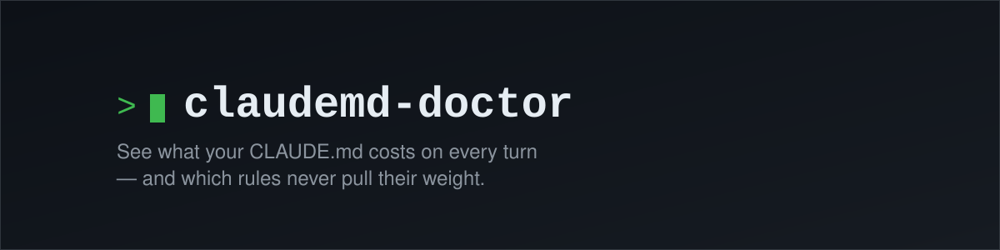
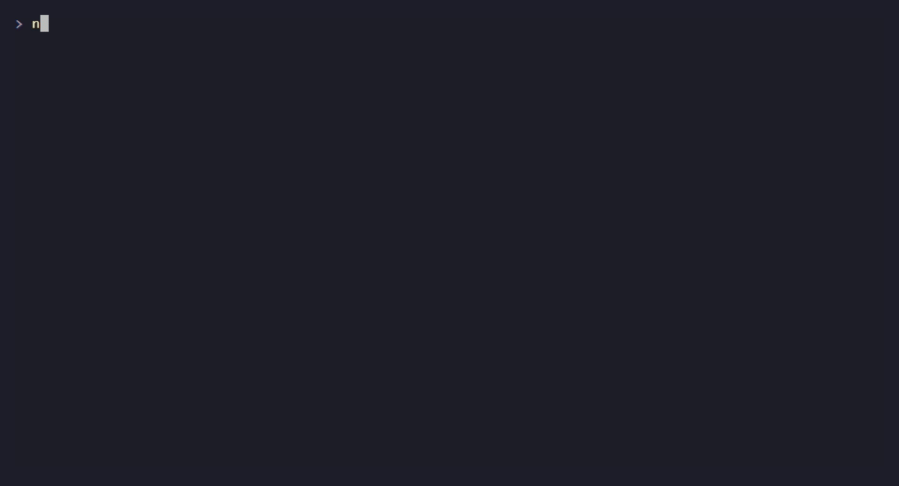

<div align="center">
  

  **See what your CLAUDE.md costs on every turn — and which rules never pull their weight.**

  [](https://www.npmjs.com/package/claudemd-doctor)
  [](https://github.com/awesomo913/claudemd-doctor/actions/workflows/ci.yml)
  [](LICENSE)
  [](package.json)
</div>



```
┌─ summary ────────────────────────────────────────
│  ≈8,686 tokens re-sent every turn  ·  $65.01/mo cached ($104.23 uncached)  ·  18.6% never referenced  ·  1 conflict
└──────────────────────────────────────────────────
```

## Why

Every turn in Claude Code re-sends your whole instruction chain — `CLAUDE.md`,
its `@imports`, `~/.claude/rules/**`, project files, auto-memory — as part of
the request. Most people have never seen that cost broken down, or checked
whether all of it is actually doing anything. On the bundled demo fixture
(`npm run demo` — a synthetic, 30-session project, not a real one):

- The instruction chain is **≈8,686 tokens**, re-sent on **every single turn**.
- At 200 turns/day that's **≈$65/month cached** (Claude Code caches the
  instruction prefix, so this is the realistic number) — **≈$104/month** if
  it never hit cache at all.
- **18.6% of those tokens (≈1,618/turn)** come from rules that were never
  referenced across the demo's 30 synthetic sessions — four of them look
  exactly like the "kept around just in case" rules every long-lived
  `CLAUDE.md` accumulates.
- It found a real conflict: one file says **"always use `npm`"**, another
  says **"never use `npm` — use `pnpm`"** — both loaded into context on every turn.
- All of this runs locally in a few seconds on real transcript history
  (under a second on the demo, which only has 30 sessions to scan) — no
  API key, no upload.

## Quick start

```bash
npx claudemd-doctor
```

Run it from inside any project. No config, no flags required.

## What it checks

1. **Instruction tree** — every file Claude Code loads for the current
   directory, in load order, with a per-file ≈token count: your
   `~/.claude/CLAUDE.md` and its `@imports` (recursive, cycle-safe),
   `~/.claude/rules/**/*.md`, every `CLAUDE.md` / `.claude/CLAUDE.md` /
   `CLAUDE.local.md` from the filesystem root down to your `cwd`, and the
   auto-memory `MEMORY.md` for the current project.
2. **Cost** — an offline ≈token-based estimate of $ per turn / per 100 turns
   / per month, for a model you pick, against a pricing table verified
   against Anthropic's published pricing (source + date shown in the output).
3. **Measured reality** — scans your real Claude Code session transcripts and
   reports how many sessions exist vs. were scanned, how many turns actually
   happened, the real input/cache-write/cache-read/output token split, and
   what the instruction chain's real re-send cost was — priced per turn using
   that turn's own recorded model, never guessed.
4. **Unreferenced rules** — splits your instruction files into individual
   rules, pulls out distinctive anchors (commands, filenames, paths), and
   checks whether each one ever shows up in your real transcripts. Gated
   behind a 20-session minimum so it doesn't guess from too little history,
   and ranked by token cost so the expensive dead weight shows up first.
   This never claims a rule is useless — only that it wasn't referenced in
   what was scanned.
5. **Conflicts & duplicates** — heuristic, fully offline: near-duplicate
   rules (prose-similarity, not just matching code/paths) and polarity
   conflicts (the same specific anchor asserted both "always" and "never").
   Tuned for precision — see [How it counts tokens](#how-it-counts-tokens)
   for what "anchor" means here.

## Example output

```
claudemd-doctor — <your project>

┌─ summary ────────────────────────────────────────
│  ≈8,686 tokens re-sent every turn  ·  $65.01/mo cached ($104.23 uncached)  ·  18.6% never referenced  ·  1 conflict
└──────────────────────────────────────────────────

1. Instruction tree (load order, ≈ tokens = offline estimate)
├── ~/.claude/CLAUDE.md [user] ≈224 tok 2.6%
│   └── ~/.claude/shared.md [import] ≈128 tok 1.5%
├── ~/.claude/rules/accessibility.md [rules] ≈251 tok 2.9%
├── ~/.claude/rules/legacy-build-pipeline.md [rules] ≈192 tok 2.2%
│   ... (28 more files)
Total: ≈8,686 tokens

2. Cost (offline estimate; pricing verified 2026-10-01 @ https://platform.claude.com/docs/en/about-claude/pricing)
  Model: claude-sonnet-5 (alias: sonnet)
  Per turn:       $0.0174 uncached  /  $0.00174 cache-read
  Per 100 turns:  $1.74 uncached  /  $0.174 cache-read
  Per month @ 200 turns/day: $104.23 uncached  /  $10.42 cache-read

3. Measured reality (from real transcripts)
  Sessions: 30 exist, 30 of 30 scanned
  Assistant turns in scanned sessions: 90

  (a) Instruction tokens re-sent ≈ 90 turns × ≈8,686 chain tok ≈ 781,740 tok
  (b) Total measured input-side context across those turns: 2,768,220 tok
  (c) Instructions are ≈28.2% of the average request
  (d) $ for (a), priced per-turn by that turn's own model: $0.975

4. Unreferenced rules (never referenced in scanned transcripts — not a claim they're useless)
  ≈1,618 tokens/turn (18.6%) are rules never referenced in 30 sessions

  ~/.claude/rules/legacy-build-pipeline.md:3 ≈166 tok (under "Legacy Build Pipeline (pending removal)")
    "The old Grunt-based asset pipeline under `tools/legacy-grunt/` is kept only for the three downstream…"
    never referenced in 30 session(s)
  ~/.claude/rules/retired-api-migration.md:3 ≈152 tok (under "Retired API Migration Notes (v1 -> v2, ...)")
    "When the internal API moved from `/api/v1/` to `/api/v2/` three years ago, every client needed to ad…"
    never referenced in 30 session(s)
  ... (+23 more — use --all-rules or --json)
  127 rule(s) unmeasurable (no extractable anchors)

5. Conflicts & duplicates (heuristic, offline)
  polarity conflict on anchor `npm`
    ~/.claude/CLAUDE.md:8 [positive] "Always use `npm` to install dependencies in this repo — the committed lockfile i"
    ~/.claude/shared.md:3 [negative] "Never use `npm` in this repo — always use `pnpm install` instead. The lockfile w"
```

(Taken from `npm run demo` — the synthetic fixture under `demo/`, not a real project.)

## Options

| Flag | Default | Description |
|---|---|---|
| `--cwd <dir>` | current directory | Analyze this directory instead |
| `--home <dir>` | `$HOME` | Use this as home (`~/.claude` lives under it); also `CLAUDEMD_DOCTOR_HOME` |
| `--all` | off | Include transcripts from every project, not just this one |
| `--agents` | off | Also show `AGENTS.md` (Codex) / `GEMINI.md` chains for comparison |
| `--max-sessions <n>` | `200` | Newest-N transcript files to scan |
| `--no-transcripts` | off | Skip the measured-reality / unreferenced-rules scan |
| `--model <name>` | `sonnet` | Pricing model: `sonnet`, `opus`, `haiku`, ... |
| `--turns-per-day <n>` | `200` | Used for the monthly cost projection |
| `--fail-over <tokens>` | — | Exit 1 if the instruction tree exceeds this many ≈tokens (for CI) |
| `--json` | off | Machine-readable JSON (stable, versioned schema) |
| `--markdown` | off | Markdown output, for pasting into issues/PRs |
| `--verbose` | off | `--json` only: include full per-turn detail, not just per-model totals |
| `--all-rules` | off | Pretty/markdown: show every unreferenced rule, not just the top 10 |
| `-h, --help` | — | Show help |
| `-v, --version` | — | Show the installed version |

## JSON schema

`--json` output is versioned (`schemaVersion`, currently `3`). Top-level
shape:

```ts
{
  schemaVersion: number,
  cwd: string,
  generatedAt: string, // ISO 8601
  tree: TreeNode[],              // annotated instruction tree
  totalTokensApprox: number,
  treeWarnings: string[],        // non-fatal tree problems (missing files, etc.)
  transcriptWarnings: string[],  // non-fatal scan problems (unreadable dirs, stat failures)
  cost: CostProjection | null,
  costError: string | null,
  measuredReality: MeasuredReality | null,   // turnDetails omitted unless --verbose
  perModelUsage: PerModelUsage[] | null,     // per-model totals, always present when scanned
  instructionReplay: InstructionReplayCost | null,
  transcriptsSkipped: boolean,
  unreferencedRules: RuleFinding[],          // ranked by token cost, descending
  unreferencedHeadline: { totalTokens, percentOfChain, sessionsScanned } | null,
  unreferencedSkippedReason: string | null,  // set when < 20 sessions were scanned
  unmeasurableRules: RuleFinding[],          // rules with no extractable anchor
  conflicts: ConflictFinding[],              // kind: "duplicate" | "polarity"
  failOverExceeded: boolean,
}
```

`measuredReality.turnDetails` — one entry per assistant turn (model, token
split) — is large (tens of thousands of entries on a real project) and is
**omitted by default**; pass `--verbose` to include it. `perModelUsage` (an
aggregate: turns and token totals per model) is always present instead.

## How it counts tokens

Every token figure is prefixed `≈` because it's an **offline estimate**: the
tool uses [`js-tiktoken`](https://github.com/dqbd/tiktoken)'s `o200k_base`
encoding (the same family OpenAI's GPT-4o models use) as a stand-in, because
Anthropic doesn't publish an offline tokenizer. In normal English/code text
this tracks Claude's real token count within roughly ±15% — close enough to
spot "this file is huge" or "this rule is dead weight," not exact enough to
reconcile against an invoice.

One more honest caveat, straight from Anthropic's own pricing page: **Claude
4.7 and later models use a newer tokenizer that produces roughly 30% more
tokens for the same text** than earlier models did. If you're on one of
those models, treat every ≈figure here as a likely undercount, not an
overcount.

"Measured reality" (section 3) sidesteps all of this for the token totals
that matter most — those numbers come from `usage` fields Anthropic's API
actually returned in your transcripts, not from re-estimating anything.

## Privacy

`claudemd-doctor` runs 100% locally. It reads only files already on your
machine — your instruction chain and your own Claude Code transcript
history — and sends nothing anywhere. No network request, no telemetry, no
account.

Pretty and markdown output also shorten paths under your home directory to
`~/...` and paths under the analyzed project to `./...`, so a screenshot or
a pasted report doesn't carry your real username or full disk layout.
`--json` keeps full absolute paths (a script parsing it shouldn't have to
guess what `~` resolves to on your machine).

## FAQ

**Does this work with Codex or Gemini CLI?**
`--agents` shows their `AGENTS.md` / `GEMINI.md` chains for size comparison.
Transcript scanning ("measured reality") is Claude Code–only for now; the
Codex transcript format doesn't carry the same per-turn usage data.

**Why is the token count different from what Claude Code shows me?**
See [How it counts tokens](#how-it-counts-tokens) — it's an offline
estimate with a different tokenizer, not Anthropic's own count.

**A rule says "unreferenced" but I know it matters. Is it useless?**
No — the report deliberately avoids that claim. "Unreferenced" means it
didn't show up in the sessions scanned, which could mean it's genuinely
unused, or it governs something rare, or the anchor extraction just missed
it. Treat it as a prompt to go look, not a verdict.

**Does this send my `CLAUDE.md` or transcripts anywhere?**
No — see [Privacy](#privacy).

## Contributing

See [CONTRIBUTING.md](CONTRIBUTING.md).

## License

[MIT](LICENSE) © awesomo913
